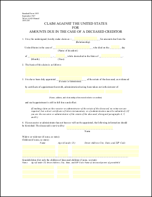
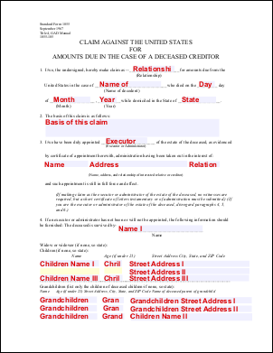

# eForm Placeholder Example

Use eForm fields as placeholders for text.

## Src
```csharp
using var doc = new Doc();
doc.Read(Server.MapPath("../mypics/form.pdf"));
doc.Form.NeedAppearances = false; // for PDF 2.0
doc.Font = doc.AddFont("Helvetica-Bold");
doc.FontSize = 16;
doc.Rect.Pin = XRect.Corner.TopLeft;
```
```vbnet
Using doc As New Doc()
  doc.Read(Server.MapPath("../mypics/form.pdf"))
  doc.Form.NeedAppearances = False ' for PDF 2.0
  doc.Font = doc.AddFont("Helvetica-Bold")
  doc.FontSize = 16
  doc.Rect.Pin = XRect.Corner.TopLeft
```

## Add
```csharp
var names = doc.Form.GetFieldNames();
foreach (string name in names) {
  Field theField = doc.Form[name];
  theField.Focus();
  doc.Color.String = "240 240 255";
  doc.FillRect();
  doc.Rect.Height = 16;
  doc.Color.String = "220 0 0";
  doc.AddText(theField.Name);
  doc.Delete(theField.ID);
}
```
```vbnet
  Dim theNames As String() = doc.Form.GetFieldNames()
  For Each theName As String In theNames
    Dim theField As Field = doc.Form(theName)
    theField.Focus()
    doc.Color.String = "240 240 255"
    doc.FillRect()
    doc.Rect.Height = 16
    doc.Color.String = "220 0 0"
    doc.AddText(theField.Name)
    doc.Delete(theField.ID)
  Next
```

## Save
```csharp
doc.Save(Server.MapPath("eform.pdf"));
```
```vbnet
  doc.Save(Server.MapPath("eform.pdf"))
End Using
```

## Results
 — form.pdf
 — eform.pdf
