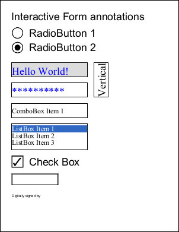
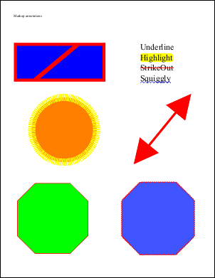
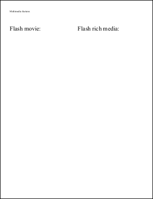
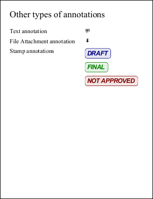

# Fields, Markup and Movies Example

Create fields, markup annotations, multimedia, and other annotations at runtime.

## Intro
Use templates for fields/annotations or create them dynamically via low-level APIs.

## Fields
```csharp
using (var doc = new Doc()) {
  doc.Font = doc.AddFont("Helvetica");
  doc.FontSize = 36;
  var cat = doc.ObjectSoup.Catalog;

  var fileTree = new EmbeddedFileTree(doc);
  fileTree.EmbedFile("MyFile1", Server.MapPath("ABCpdf.swf"), "attachment without annotation");
  doc.SetInfo(doc.Root, "/PageMode:Name", "UseAttachments");

  doc.Pos.X = 40;
  doc.Pos.Y = doc.MediaBox.Top - 40;
  doc.AddText("Interactive Form annotations");

  var form = doc.Form;
  int fontID = doc.AddFont("Times-Roman", LanguageType.Latin);
  string fontName = form.AddResource(doc.ObjectSoup[fontID], "Font", "TimesRoman");

  var radio = form.AddRadioButtonGroup(new XRect[] { new XRect("40 610 80 650"), new XRect("40 660 80 700") }, "RadioGroupField", 0);
  doc.Pos.String = "100 696"; doc.AddText("RadioButton 1");
  doc.Pos.String = "100 646"; doc.AddText("RadioButton 2");

  var text = form.AddTextField(new XRect("40 530 300 580"), "TextField1", "Hello World!");
  var textE = new FieldElement(text);
  var textW = new WidgetAnnotationElement(text);
  textE.EntryDA = $"/{fontName} 36 Tf 0 0 1 rg";
  textW.EntryMK = new AppearanceCharacteristicsElement(textE);
  textW.EntryMK.EntryBC = new double[] { 0, 0, 0 };
  textW.EntryMK.EntryBG = new double[] { 220.0/255.0, 220.0/255.0, 220.0/255.0 };
  textE.EntryQ = 0;

  // additional fields omitted for brevity...
  doc.Save(Server.MapPath("annotations1.pdf"));
}
```

## Markup
```csharp
using (var doc = new Doc()) {
  doc.Page = doc.AddPage();
  doc.Pos.X = 40;
  doc.Pos.Y = doc.MediaBox.Top - 40;
  doc.AddText("Markup annotations");
  var cat = doc.ObjectSoup.Catalog;

  var square = new SquareAnnotation(doc, new XRect("40 560 300 670"), XColor.FromRgb(255, 0, 0), XColor.FromRgb(0, 0, 255));
  square.SquareElement.EntryBS = new BorderStyleElement(square.SquareElement);
  square.SquareElement.EntryBS.EntryW = 8;

  var line = new LineAnnotation(doc, new XPoint("100 565"), new XPoint("220 665"), XColor.FromRgb(255, 0, 0));
  line.LineElement.EntryBS = new BorderStyleElement(line.LineElement);
  line.LineElement.EntryBS.EntryW = 12;
  line.RichTextCaption = "<span style= \"font-size:36pt; color:#FF0000\">Line</span>";

  // text markup examples, circle with dashed border, arrow lines, polygons...
  doc.Save(Server.MapPath("annotations2.pdf"));
}
```

## Movies
```csharp
using (var doc = new Doc()) {
  doc.Page = doc.AddPage();
  doc.Pos.X = 40;
  doc.Pos.Y = doc.MediaBox.Top - 40;
  doc.AddText("Multimedia features");
  doc.FontSize = 24;

  doc.Pos.String = "40 690";
  doc.AddText("Flash movie:");
  var movie1 = new ScreenAnnotation(doc, new XRect("40 420 300 650"), Server.MapPath("ABCpdf.swf"));

  doc.Pos.String = "312 690";
  doc.AddText("Flash rich media:");
  var media1 = new RichMediaAnnotation(doc, new XRect("312 420 572 650"), Server.MapPath("ABCpdf.swf"), "Flash");
  doc.Save(Server.MapPath("annotations3.pdf"));
}
```

## Other
```csharp
using (var doc = new Doc()) {
  doc.Page = doc.AddPage();
  doc.FontSize = 36;
  doc.Pos.X = 40;
  doc.Pos.Y = doc.MediaBox.Top - 40;
  doc.AddText("Other types of annotations");

  doc.FontSize = 24;
  doc.Pos.String = "40 680"; doc.AddText("Text annotation");
  var textAnnotation = new TextAnnotation(doc, new XRect("340 660 360 680"), new XRect("550 650 600 750"), "6 sets of 13 pages. Trim to 5X7.");

  doc.Pos.String = "40 640"; doc.AddText("File Attachment annotation");
  var fileAttachment = new FileAttachmentAnnotation(doc, new XRect("340 620 360 640"), Server.MapPath("video.WMV"));

  doc.Pos.String = "40 600"; doc.AddText("Stamp annotations");
  var stamp1 = new StampAnnotation(doc, new XRect("340 560 540 600"), "DRAFT", XColor.FromRgb(0, 0, 128));
  var stamp2 = new StampAnnotation(doc, new XRect("340 505 540 545"), "FINAL", XColor.FromRgb(0, 128, 0));
  var stamp3 = new StampAnnotation(doc, new XRect("340 450 540 490"), "NOT APPROVED", XColor.FromRgb(128, 0, 0));
  doc.Save(Server.MapPath("annotations4.pdf"));
}
```

## Results
 — Fields
 — Markup
 — Movies
 — Other
