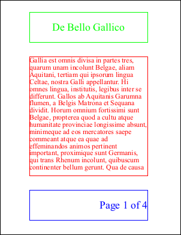
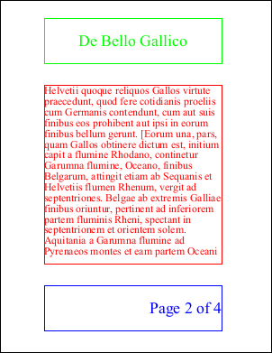
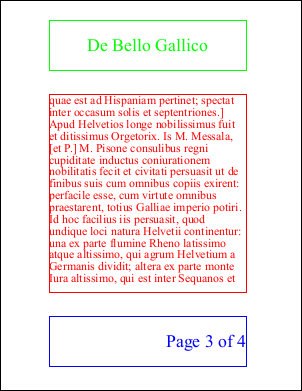
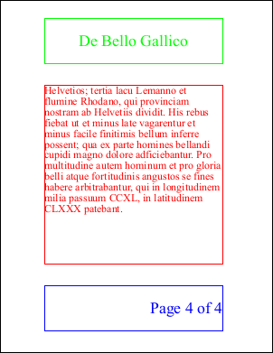

# Headers and Footers Example

One method of adding headers and footers.

## Setup
```csharp
using var doc = new Doc();
string text = "Gallia est omnis divisa in partes tres, quarum unam incolunt Belgae, aliam Aquitani, tertiam ...";
```
```vbnet
Using doc As New Doc()
  Dim theID As Integer, theCount As Integer
  Dim theText As String = "Gallia est omnis divisa in partes tres, quarum unam incolunt Belgae, aliam Aquitani, tertiam ..."
```

## Content
```csharp
doc.Rect.String = "100 200 500 600";
doc.Color.String = "255 0 0";
doc.FontSize = 24;
int id = doc.AddTextStyled(text);
doc.FrameRect();
while (doc.Chainable(id)) {
  doc.Page = doc.AddPage();
  id = doc.AddTextStyled("", id);
  doc.FrameRect();
}
int count = doc.PageCount;
```
```vbnet
  doc.Rect.String = "100 200 500 600"
  doc.Color.String = "255 0 0"
  doc.FontSize = 24
  theID = doc.AddTextStyled(theText)
  doc.FrameRect()
  While doc.Chainable(theID)
    doc.Page = doc.AddPage()
    theID = doc.AddTextStyled("", theID)
    doc.FrameRect()
  End While
  theCount = doc.PageCount
```

## Header
```csharp
doc.Rect.String = "100 650 500 750";
doc.TextStyle.HPos = 0.5;
doc.TextStyle.VPos = 0.5;
doc.Color.String = "0 255 0";
doc.FontSize = 36;
for (int i = 1; i <= count; i++) {
  doc.PageNumber = i;
  doc.AddText("De Bello Gallico");
  doc.FrameRect();
}
```
```vbnet
  doc.Rect.String = "100 650 500 750"
  doc.TextStyle.HPos = 0.5
  doc.TextStyle.VPos = 0.5
  doc.Color.String = "0 255 0"
  doc.FontSize = 36
  Dim i As Integer = 1
  While i <= theCount
    doc.PageNumber = i
    doc.AddText("De Bello Gallico")
    doc.FrameRect()
    System.Math.Max(System.Threading.Interlocked.Increment(i), i - 1)
  End While
```

## Footer
```csharp
doc.Rect.String = "100 50 500 150";
doc.TextStyle.HPos = 1.0;
doc.TextStyle.VPos = 0.5;
doc.Color.String = "0 0 255";
doc.FontSize = 36;
for (int i = 1; i <= count; i++) {
  doc.PageNumber = i;
  doc.AddText("Page " + i.ToString() + " of " + count.ToString());
  doc.FrameRect();
}
```
```vbnet
  doc.Rect.String = "100 50 500 150"
  doc.TextStyle.HPos = 1.0
  doc.TextStyle.VPos = 0.5
  doc.Color.String = "0 0 255"
  doc.FontSize = 36
  Dim i As Integer = 1
  While i <= theCount
    doc.PageNumber = i
    doc.AddText("Page " + i.ToString() + " of " + theCount.ToString())
    doc.FrameRect()
    System.Math.Max(System.Threading.Interlocked.Increment(i), i - 1)
  End While
```

## Save
```csharp
doc.Save(Server.MapPath("headerfooter.pdf"));
```
```vbnet
  doc.Save(Server.MapPath("headerfooter.pdf"))
End Using
```

## Results
 — Page 1
 — Page 2
 — Page 3
 — Page 4
