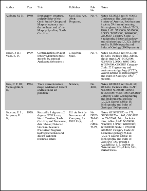
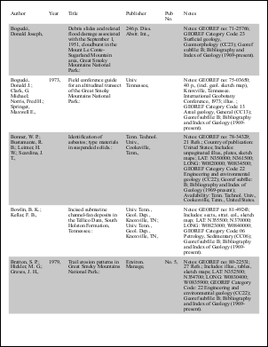
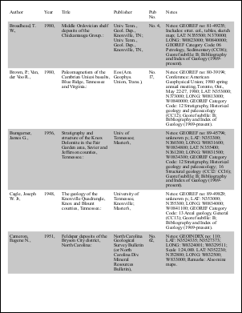

# Large Table Example

Draw a multi-page table using `PDFTable` with repeating headers and column widths.

## Setup
```csharp
string text = File.ReadAllText(Server.MapPath("text7.txt"));
using var doc = new Doc();
// set up document
doc.FontSize = 12;
doc.Rect.Inset(20, 20);
```
```vbnet
Dim theText As String = File.ReadAllText(Server.MapPath("text7.txt"))
Using doc As New Doc()
  ' set up document
  doc.FontSize = 12
  doc.Rect.Inset(20, 20)
```

## Table
```csharp
PDFTable theTable = new PDFTable(doc, 6);
// some columns extra width
theTable.SetColumnWidths(new double[] { 2, 1, 3, 2, 1, 4 });
theTable.CellPadding = 5;
theTable.RepeatHeader = true;
```
```vbnet
  Dim theTable As New PDFTable(doc, 6)
  ' some columns extra width
  theTable.SetColumnWidths(New Double() {2, 1, 3, 2, 1, 4})
  theTable.CellPadding = 5
  theTable.RepeatHeader = True
```

## Add Rows
```csharp
text = text.Replace("\r\n", "\r");
string[] theRows = text.Split(new char[] { '\r' });
int thePage = 1;
bool theShade = false;
for (int i = 0; i < theRows.Length; i++) {
  theTable.NextRow();
  string[] theCols = theRows[i].Split(new char[] { '\t' });
  theTable.AddTextStyled(theCols);
  if (doc.PageNumber > thePage) {
    thePage = doc.PageNumber;
    theShade = true;
  }
  if (theShade)
    theTable.FillRow("200 200 200", theTable.Row);
  theShade = !theShade;
}
doc.Flatten();
doc.Save(Server.MapPath("table2.pdf"));
```
```vbnet
  theText = theText.Replace(vbCr & vbLf, vbCr)
  Dim theRows As String() = theText.Split(New Char() {ControlChars.Cr})
  Dim thePage As Integer = 1
  Dim theShade As Boolean = False
  Dim i As Integer = 0
  While i < theRows.Length
    theTable.NextRow()
    Dim theCols As String() = theRows(i).Split(New Char() {ControlChars.Tab})
    theTable.AddTextStyled(theCols)
    If doc.PageNumber > thePage Then
      thePage = doc.PageNumber
      theShade = True
    End If
    If theShade Then
      theTable.FillRow("200 200 200", theTable.Row)
    End If
    theShade = Not theShade
    System.Math.Max(System.Threading.Interlocked.Increment(i), i - 1)
  End While
  doc.Flatten()
  doc.Save(Server.MapPath("table2.pdf"))
End Using
```

## Results
 — Page 1
 — Page 2
 — Page 3
 — Page 4
 — Page 5
