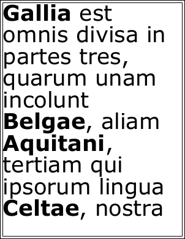

# Multistyle Example

Create multistyled text using embedded fonts and styled runs.

## Setup
```csharp
string text = "<b>Gallia</b> est omnis divisa in partes tres, quarum unam incolunt <b>Belgae</b>, aliam <b>Aquitani</b>, tertiam qui ipsorum lingua <b>Celtae</b>, nostra <b>Galli</b> appellantur.";
```
```vbnet
Dim theText As String = "<b>Gallia</b> est omnis divisa in partes tres, quarum unam incolunt <b>Belgae</b>, aliam <b>Aquitani</b>, tertiam qui ipsorum lingua <b>Celtae</b>, nostra <b>Galli</b> appellantur."
```

## Doc Obj
```csharp
using var doc = new Doc();
doc.FontSize = 72;
doc.Rect.Inset(10, 10);
doc.FrameRect();
int font1 = doc.EmbedFont("Verdana", LanguageType.Latin, false, true);
int font2 = doc.EmbedFont("Verdana Bold", LanguageType.Latin, false, true);
```
```vbnet
Using doc As New Doc()
  doc.FontSize = 72
  doc.Rect.Inset(10, 10)
  doc.FrameRect()
  Dim theFont1 As Integer = doc.EmbedFont("Verdana", LanguageType.Latin, False, True)
  Dim theFont2 As Integer = doc.EmbedFont("Verdana Bold", LanguageType.Latin, False, True)
```

## Adding
```csharp
text = "<font pid=" + font1.ToString() + ">" + text + "</font>";
text = text.Replace("<b>", "<font pid=" + font2.ToString() + ">");
text = text.Replace("</b>", "</font>");
doc.AddTextStyled(text);
```
```vbnet
  theText = "<font pid=" + theFont1.ToString() + ">" + theText + "</font>"
  theText = theText.Replace("<b>", "<font pid=" + theFont2.ToString() + ">")
  theText = theText.Replace("</b>", "</font>")
  doc.AddTextStyled(theText)
```

## Save
```csharp
doc.Save(Server.MapPath("styles.pdf"));
```
```vbnet
  doc.Save(Server.MapPath("styles.pdf"))
End Using
```

## Results
 — styles.pdf
