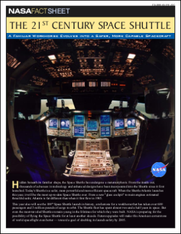
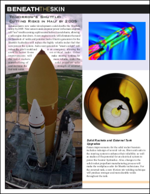
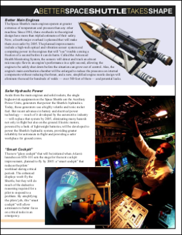
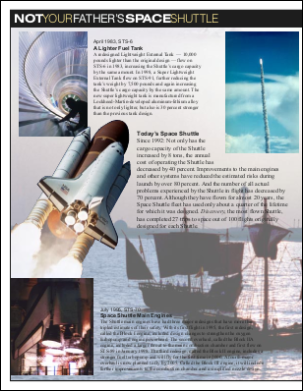

# PDF Rendering Example

Render a PDF document to images.

## Read
```csharp
using Doc doc = new Doc();
doc.Read(Server.MapPath("../Rez/spaceshuttle.pdf"));
```
```vbnet
Dim doc As New Doc()
doc.Read(Server.MapPath("../Rez/spaceshuttle.pdf"))
```

## Prefs
```csharp
doc.Rendering.DotsPerInch = 36;
```
```vbnet
doc.Rendering.DotsPerInch = 36
```

## Save
```csharp
for (int i = 1; i <= 4; i++) {
  doc.PageNumber = i;
  doc.Rect.String = doc.CropBox.String;
  doc.Rendering.Save(Server.MapPath("shuttle_p" + i.ToString() + ".png"));
}
```
```vbnet
Dim i As Integer = 1
While i <= 4
  doc.PageNumber = i
  doc.Rect.String = doc.CropBox.String
  doc.Rendering.Save(Server.MapPath("shuttle_p" + i.ToString() + ".png"))
  System.Math.Max(System.Threading.Interlocked.Increment(i), i - 1)
End While
```

## Results
 — Page 1
 — Page 2
 — Page 3
 — Page 4
