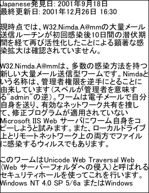
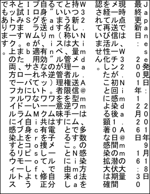

# Unicode Example

Add complex scripts (Chinese, Japanese, Korean) using embedded Unicode fonts.

## Setup
```csharp
using var doc = new Doc();
doc.FontSize = 32;
```
```vbnet
Using doc As New Doc()
  doc.FontSize = 32
```

## Read
```csharp
string path = Server.MapPath("../Rez/Japanese2.txt");
string text = File.ReadAllText(path);
```
```vbnet
  Dim thePath As String = Server.MapPath("../Rez/Japanese2.txt")
  Dim theText As String = File.ReadAllText(thePath)
```

## Add (LTR)
```csharp
doc.Page = doc.AddPage();
doc.Font = doc.EmbedFont("MS PGothic", LanguageType.Unicode, false, true);
doc.AddText("Japanese" + text);
```
```vbnet
  doc.Page = doc.AddPage()
  doc.Font = doc.EmbedFont("MS PGothic", LanguageType.Unicode, False, True)
  doc.AddText("Japanese" + theText)
```

## Add (Vertical)
```csharp
doc.Page = doc.AddPage();
doc.Font = doc.EmbedFont("MS PGothic", LanguageType.Unicode, true, true);
doc.AddText("Japanese" + text);
```
```vbnet
  doc.Page = doc.AddPage()
  doc.Font = doc.EmbedFont("MS PGothic", LanguageType.Unicode, True, True)
  doc.AddText("Japanese" + theText)
```

## Save
```csharp
doc.Save(Server.MapPath("unicode.pdf"));
// finished
```
```vbnet
  doc.Save(Server.MapPath("unicode.pdf"))
End Using
' finished
```

## Results
 — Page 1
 — Page 2
