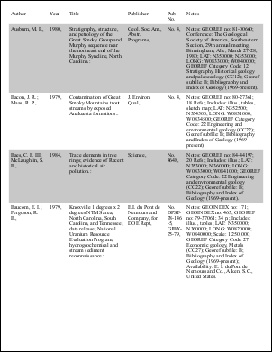
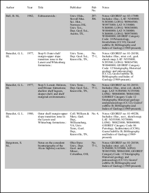
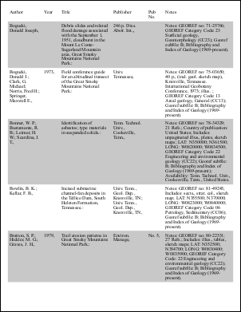
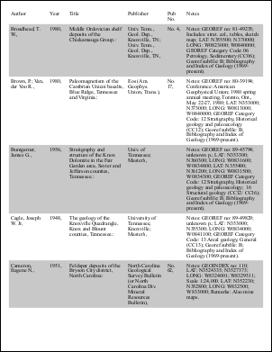
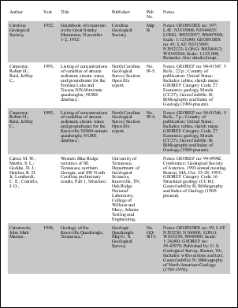

# WPF Tables Example

Import WPF XAML tables into a PDF document by first producing XPS.

## Intro
Tables defined in XAML (e.g., `SmallTable.xaml`, `LargeTable.xaml`) are loaded, programmatically expanded (row duplication for list binding), written to XPS, then converted to PDF.

Limitations:
- No row/column borders (only table/cell borders and backgrounds).
- No automatic header/footer repetition across pages.
- No direct list binding; rows duplicated in code.

## XAML
SmallTable example structure:
```xml
<Table Name="ItemsTable" CellSpacing="10" BorderBrush="Black" BorderThickness="2" TextAlignment="Justify">
  <Table.Columns>
    <TableColumn Width="120"/>
    <TableColumn Width="180"/>
    <TableColumn Width="120"/>
    <TableColumn Width="140"/>
    <TableColumn Width="140"/>
  </Table.Columns>
  <TableRowGroup Background="White" DataContext="{Binding Source={StaticResource InputData}, Path=[0]}">
    <TableRow>
      <TableCell><Paragraph><TextBlock TextWrapping="Wrap" Text="{Binding Path=Columns[0]}"/></Paragraph></TableCell>
      <TableCell><Paragraph><TextBlock TextWrapping="Wrap" Text="{Binding Path=Columns[1]}"/></Paragraph></TableCell>
      <TableCell><Paragraph><TextBlock TextWrapping="Wrap" Text="{Binding Path=Columns[2]}"/></Paragraph></TableCell>
      <TableCell><Paragraph><TextBlock TextWrapping="Wrap" Text="{Binding Path=Columns[3]}"/></Paragraph></TableCell>
      <TableCell><Paragraph><TextBlock TextWrapping="Wrap" Text="{Binding Path=Columns[4]}"/></Paragraph></TableCell>
    </TableRow>
  </TableRowGroup>
</Table>
```
Data provider:
```xml
<c:TextDataProvider x:Key="InputData" FileName="text6.txt"/>
```

## Bind
Duplicate row groups and adjust `DataContext` bindings.
```csharp
MemoryStream ModifyXamlUsingTextProvider(string mDataProvider, string mXamlFile, string mTableXamlLocation, string mTableName) {
  var dataProvider = new TextDataProvider(mDataProvider);
  var xamlDoc = new XmlDocument();
  var xamlFile = new FileStream(mXamlFile, FileMode.Open);
  xamlDoc.Load(xamlFile);

  var nsmgr = new XmlNamespaceManager(xamlDoc.NameTable);
  nsmgr.AddNamespace("x", "http://schemas.microsoft.com/winfx/2006/xaml/presentation");

  var itemsTable = xamlDoc.DocumentElement.SelectSingleNode(mTableXamlLocation + "[@Name='" + mTableName + "']", nsmgr);

  for (int i = 1; i < dataProvider.Count; i++) {
    var rowGroup = itemsTable.LastChild;
    var newRowGroup = rowGroup.Clone();
    string bindingText = newRowGroup.Attributes["DataContext"].Value;
    bindingText = bindingText.Remove(bindingText.LastIndexOf('[')) + "[" + i + "] }";
    newRowGroup.Attributes["DataContext"].Value = bindingText;
    newRowGroup.Attributes["Background"].Value = (i % 2) == 0 ? "White" : "LightGray";
    itemsTable.InsertAfter(newRowGroup, rowGroup);
  }

  var memStream = new MemoryStream();
  xamlDoc.Save(memStream);
  xamlFile.Close();
  return memStream;
}
```
Load the document and detach the Page wrapper:
```csharp
using var stm = ModifyXamlUsingTextProvider(null, null, null, null);
var page = XamlReader.Load(stm) as System.Windows.Controls.Page;
var docViewer = LogicalTreeHelper.FindLogicalNode(page, "DocViewer") as FlowDocumentPageViewer;
page.Content = null;
```

## Save
First produce XPS, then convert to PDF.
```csharp
void SaveToXps(Stream fileStream, FlowDocumentPageViewer viewer) {
  using var package = Package.Open(fileStream, FileMode.Create, FileAccess.ReadWrite);
  using var doc = new XpsDocument(package);
  var writer = XpsDocument.CreateXpsDocumentWriter(doc);
  var document = viewer.Document;
  writer.Write(document.DocumentPaginator);
}

void SaveToPdf(string pdfFileName, FlowDocumentPageViewer viewer) {
  using var memStream = new MemoryStream();
  SaveToXps(memStream, viewer);
  using var pdfDoc = new Doc();
  pdfDoc.Read(memStream, new XReadOptions() { FileExtension = ".xps" });
  pdfDoc.Save(pdfFileName);
}
```

## Results
Similar to [Large Table Example](10-table2.htm):
 — Page 1
 — Page 2
 — Page 3
 — Page 4
 — Page 5
