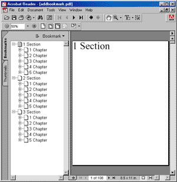

# AddBookmark Function

Adds a bookmark pointing to the current page.

## Syntax

```csharp
int AddBookmark(string path, bool open)
```

## Params

| Name | Description |
| --- | --- |
| path | The path to the bookmark. |
| open | Whether the bookmark should be displayed open (expanded) or closed (collapsed). |
| return | The Object ID of the newly added Bookmark Object. |

## Notes

Adds a bookmark referencing the current page.

- Bookmark paths use `\` as separators for headings and subheadings, e.g., `"1. Introduction\1.1 Aim and Methods\1.1.3 Diagrams"`.
- Intermediate headings/subheadings are auto-created if missing.
- Call multiple times to add multiple bookmarks pointing to the same page.

Hyperlinks: You can make bookmarks open external URIs. Ensure URLs are trusted.

```csharp
static int AddBookmarkToUri(Doc doc, string bookmark, string uri) {
    int id = doc.AddBookmark(bookmark, true);
    doc.SetInfo(id, "/Dest:Del", "");
    doc.SetInfo(id, "/A", "<< /Type /Action /S /URI /URI () >>");
    doc.SetInfo(id, "/A/URI:Text", uri);
    return id;
}
```

## Example

Add nested bookmarks across pages.

```csharp
using var doc = new Doc();
doc.FontSize = 64;
for (int i = 1; i < 4; i++) {
    doc.Page = doc.AddPage();
    string theSection = $"{i} Section";
    doc.AddText(theSection);
    doc.AddBookmark(theSection, true);
    for (int j = 1; j < 6; j++) {
        doc.Page = doc.AddPage();
        string theChapter = $"{theSection}\\{j} Chapter";
        doc.AddText(theChapter);
        doc.AddBookmark(theChapter, false);
        for (int k = 1; k < 7; k++) {
            doc.Page = doc.AddPage();
            string theSubject = $"{theChapter}\\{k} Subject";
            doc.AddText(theSubject);
            doc.AddBookmark(theSubject, true);
        }
    }
}
doc.Save(Server.MapPath("docaddbookmark.pdf")); // Windows specific
```

## Results

 — docaddbookmark.pdf
