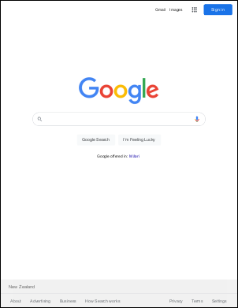

# AddImageUrl Function

Renders a web page specified by URL.

- Class: `Doc`
- Returns: The ID of the newly added object
- May throw: `Exception()`

## Syntax
```csharp
int AddImageUrl(string url);
int AddImageUrl(string url, bool paged, int width, bool disableCache);
```
```vbnet
Function AddImageUrl(url As String) As Integer
Function AddImageUrl(url As String, paged As Boolean, width As Integer, disableCache As Boolean) As Integer
```

## Parameters
- **url**: The URL for the page to be rendered. The actual value may be modified depending on `disableCache`/[XHtmlOptions.PageCacheEnabled](../../xhtmloptions/2-properties/pagecacheenabled.htm).
- **paged**: Overrides the default [XHtmlOptions.Paged](../../xhtmloptions/2-properties/paged.htm) property.
- **width**: Overrides the default [XHtmlOptions.BrowserWidth](../../xhtmloptions/2-properties/browserwidth.htm) property.
- **disableCache**: Overrides and disables the page cache. See [XHtmlOptions.PageCacheEnabled](../../xhtmloptions/2-properties/pagecacheenabled.htm).

## Notes
- Adds a web page to a document according to the current [XHtmlOptions](../../xhtmloptions/default.htm). Common options can be overridden via parameters above.
- Only the first page is drawn. Chain subsequent pages using [AddImageToChain](addimagetochain.htm).
- The web page is scaled to fill the current [Rect](../2-properties/rect.htm) and transformed using the current [Transform](../../xtransform/default.htm).

### Caching
Sometimes pages appear to be cached.
- When using `AddImageUrl`, the URL content may be cached; see the [HTML / CSS Rendering](../../../3-concepts/g-htmlrender.htm) discussion for details.
- Alternatively the PDF itself may be cached when streamed to a browser if certain IIS settings (e.g., “Expire Content”) are disabled.
- To diagnose, save the PDF to disk as well as streaming it to the client to determine whether the PDF or its source content is cached.
- If the PDF is cached, check IIS/ASP settings, proxy behavior, or client caching.

### MHT (MIME HTML)
- Also accepts file-based URLs to MHT files containing a web page and its resources.
- Complex pages saved as MHT may omit some required resources; ABCpdf attempts to download missing items from the original URL if available.

### Security
- Only use URLs from trusted sources. See the Security section of [HTML / CSS Rendering](../../../3-concepts/g-htmlrender.htm).

## Example
We create an ABCpdf `Doc`, add our URL, and save.

```csharp
using var doc = new Doc();
doc.AddImageUrl("http://www.google.com/");
doc.Save(Server.MapPath("htmlimport.pdf"));
```
```vbnet
Using doc As New Doc()
  doc.AddImageUrl("http://www.google.com/")
  doc.Save(Server.MapPath("htmlimport.pdf"))
End Using
```

## Result

 — htmlimport.pdf

See also: [AddImageToChain](addimagetochain.htm)
