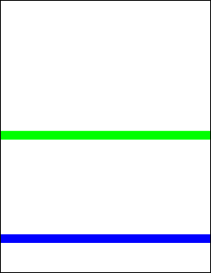

# AddLine Function

Adds a line to the current page.

## Syntax

```csharp
int AddLine(double x1, double y1, double x2, double y2)
int AddLine(double x1, double y1, double x2, double y2, LineEnding ending1, LineEnding ending2)
int AddLine(double x1, double y1, double x2, double y2, LineEnding ending1, LineEnding ending2, double scale1, double scale2)
```

## Params

| Name | Description |
| --- | --- |
| x1 | The horizontal offset of the start point. |
| y1 | The vertical offset of the start point. |
| x2 | The horizontal offset of the end point. |
| y2 | The vertical offset of the end point. |
| ending1 | Line ending at the start of the line. Default is `None`. |
| ending2 | Line ending at the end of the line. Default is `None`. |
| scale1 | Scaling applied to the line ending at the start. Default `1.0`. |
| scale2 | Scaling applied to the line ending at the end. Default `1.0`. |
| return | The Object ID of the newly added Graphic Object. |

## Notes

Draws a line using the current color, width, and options.

Line endings (e.g., arrows, diamonds) can be placed at the start, end, or both. The `LineEnding` enum includes `None`, `Square`, `Circle`, `Diamond`, `OpenArrow`, `ClosedArrow`, `Butt`, `BigButt`, `ReverseOpenArrow`, `ReverseClosedArrow`, `Slash`, `Arrowhead`.

Ending size scales with line width; additional scaling factors allow fine control. Tips are positioned precisely at line ends; reversed endings extend past the line end.

## Example

Two horizontal lines, one blue and one green.

```csharp
using var doc = new Doc();
doc.Width = 24;
doc.Color.String = "0 0 255";
doc.AddLine(-50, 100, 999, 100);
doc.Color.String = "0 255 0";
doc.AddLine(-50, 400, 999, 400);
doc.Save(Server.MapPath("docaddline.pdf")); // Windows specific
```

## Results

 — docaddline.pdf
