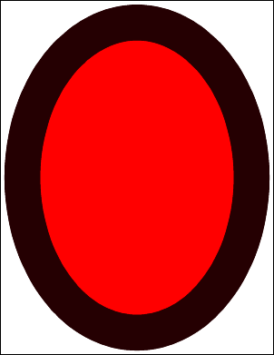

# AddOval Function

Adds an oval to the current page.

## Syntax

```csharp
int AddOval(bool filled)
```

## Params

| Name | Description |
| --- | --- |
| filled | Whether to fill the oval rather than simply outline it. |
| return | The Object ID of the newly added Graphic Object. |

## Notes

Draws an oval scaled to the current rectangle using the current color, line width, and options. May be outlined or filled.

## Example

Two ovals, one filled and one semi-transparent outline.

```csharp
using var doc = new Doc();
doc.Width = 80;
doc.Rect.Inset(50, 50);
doc.Color.String = "255 0 0";
doc.AddOval(true);
doc.Color.String = "0 255 0 128";
doc.AddOval(false);
doc.Save(Server.MapPath("docaddoval.pdf")); // Windows specific
```

## Results

 — docaddoval.pdf
