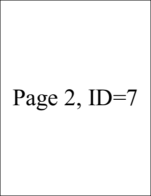
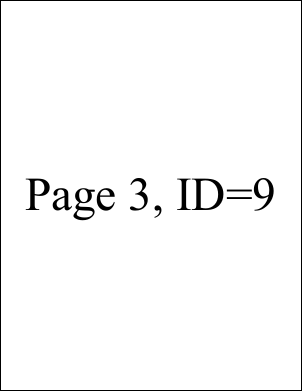

# AddPage Function

Adds a page to the current document.

## Syntax

```csharp
int AddPage();
int AddPage(int page);
```

## Params

| Name | Description |
| --- | --- |
| page | The page insertion location. By default, pages are added at the end of the document. |
| return | The Object ID of the newly added Page Object. |

## Notes

Adds a page to the current document.

Typically you will assign the returned Object ID to the document `Page` property, for example:

```csharp
theDoc.Page = theDoc.AddPage();
```

To insert at a specific location (e.g., start of the document):

```csharp
theDoc.Page = theDoc.AddPage(1);
```

Existing pages at or after the insertion point shift toward the end of the document.

## Example

Adds three pages and marks each with page number and page Object ID.

```csharp
using var doc = new Doc();
doc.FontSize = 96; // big text
doc.TextStyle.HPos = 0.5; // centered
doc.TextStyle.VPos = 0.5; // ...
for (int i = 1; i <= 3; i++) {
    doc.Page = doc.AddPage();
    string txt = $"Page {i}, ID={doc.Page}";
    doc.AddText(txt);
}
doc.Save(Server.MapPath("docaddpage.pdf")); // Windows specific
```

## Results

 — Page 1
 — Page 2
 — Page 3
