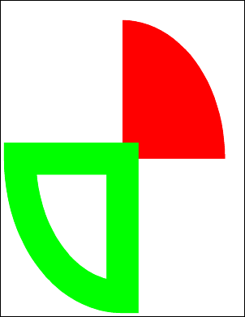

# AddPie Function

Adds a pie slice to the current page.

## Syntax

```csharp
int AddPie(double angleStart, double angleEnd, bool filled)
```

## Params

| Name | Description |
| --- | --- |
| angleStart | The start angle of the pie slice in degrees. |
| angleEnd | The end angle of the pie slice in degrees. |
| filled | Whether to fill the pie slice rather than simply outline it. |
| return | The Object ID of the newly added Graphic Object. |

## Notes

Adds a pie slice to the current page. The slice is drawn in the current color at the current width and with the current options.

The pie slice represents a segment of the oval which would fill the current rectangle. Drawing starts at the start angle and the arc is swept out until the end angle is reached. Angles are measured anti-clockwise with zero at three o'clock. The slice may be outlined or filled depending on the values passed to the function.

The AddPie function returns the Object ID of the newly added Graphic Object.

## Example

The following code adds two pie slices to a document.

```csharp
using var doc = new Doc();
doc.Width = 80;
doc.Rect.Inset(50, 50);
doc.Color.String = "255 0 0";
doc.AddPie(0, 90, true);
doc.Color.String = "0 255 0";
doc.AddPie(180, 270, false);
doc.Save(Server.MapPath("docaddpie.pdf")); // Windows specific);
```

## Results

 — docaddpie.pdf
