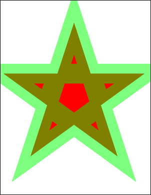

# AddPoly Function

Adds a polygon to the current page.

## Syntax

```csharp
int AddPoly(string points, bool filled)
int AddPoly(double[] points, bool filled)
int AddPoly(double[] points, int index, int count, bool filled)
```

## Params

| Name | Description |
| --- | --- |
| points | Coordinates of polygon vertices. |
| index | Index of the first coordinate in the array. |
| count | Number of coordinates to use. |
| filled | Whether to fill the polygon rather than simply outline it. |
| return | The Object ID of the newly added Graphic Object. |

## Notes

Draws a polygon using the current color, width, and options. The `points` string is formatted as `x1 y1 x2 y2 ... xN yN` with spaces, commas, or semicolons as delimiters. If the first point equals the last, the path is closed before outlining.

## Example

Transparent green outline over a red filled star.

```csharp
using var doc = new Doc();
doc.Width = 80;
doc.Color.String = "255 0 0";
doc.AddPoly("124 158 300 700 476 158 15 493 585 493 124 158", true);
doc.Color.String = "0 255 0 a128";
doc.AddPoly("124 158 300 700 476 158 15 493 585 493 124 158", false);
doc.Save(Server.MapPath("docaddpoly.pdf")); // Windows specific
```

## Results

 — docaddpoly.pdf
