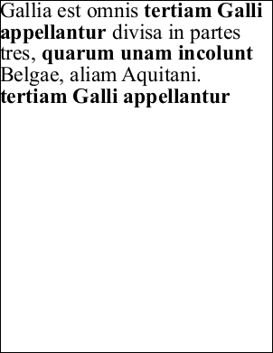

# AddText Function

Adds a block of single styled text to the current page.

## Syntax

```csharp
int AddText(string text)
```

## Params

| Name | Description |
| --- | --- |
| text | The text to be added to the page. |
| return | The Object ID of the newly added Text Object. |

## Notes

Adds a block of single styled text to the current page.

- For multi-styled text or chained text across pages, use `AddTextStyled` for styled text.
- Text uses the current style, font size, and color, and starts at the current position. Long text wraps within the current rectangle according to horizontal and vertical positioning.
- Chain text by first adding a block via `AddText`, then adding additional blocks via `AddTextStyled`, passing the prior block ID and adjusting target location.
- Returns zero if no text could be added (empty string or rectangle too small).
- If text is not displayed and return is zero, check text size, verify rectangle placement (e.g., with `FrameRect`), and ensure `Pos` starts at the top-left of the rectangle.
- After text draw, `Pos` updates to the next insertion point.
- `FontSize` controls line height; baseline is ~80% down from the top of the line.

## Example

Adds chunks of text in alternating fonts, relying on `Pos` updates.

```csharp
using var doc = new Doc();
doc.Page = doc.AddPage();
doc.FontSize = 48;
int font1 = doc.AddFont("Times-Roman");
int font2 = doc.AddFont("Times-Bold");
doc.Font = font1;
doc.AddText("Gallia est omnis ");
doc.Font = font2;
doc.AddText("tertiam Galli appellantur ");
doc.Font = font1;
doc.AddText("divisa in partes tres, ");
doc.Font = font2;
doc.AddText("quarum unam incolunt ");
doc.Font = font1;
doc.AddText("Belgae, aliam Aquitani. ");
doc.Font = font2;
doc.AddText("tertiam Galli appellantur");
doc.Save(Server.MapPath("docaddtext.pdf")); // Windows specific
```

## Results

 — docaddtext.pdf
