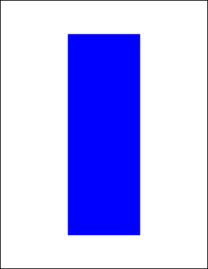

# FillRect Function

Adds a painted rectangle to the current page.

## Syntax

```csharp
int FillRect()
int FillRect(double radiusX, double radiusY)
```

## Params

| Name | Description |
| --- | --- |
| radiusX | Horizontal radius for rounded corners. |
| radiusY | Vertical radius for rounded corners. |
| return | The Object ID of the newly added Graphic Object. |

## Notes

Adds a filled rectangle positioned by the current rectangle and using the current color and options. Corner radii produce rounded corners; half width/height yields filled ovals or circles.

## Example

Inset rect, set color, and fill.

```csharp
using var doc = new Doc();
doc.Rect.Inset(200, 100);
doc.Color.Blue = 255;
doc.FillRect();
doc.Save(Server.MapPath("docfillrect.pdf")); // Windows specific
```

## Results

 — docfillrect.pdf
