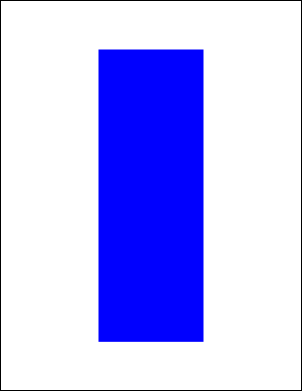

# FillRect Function

Adds a painted rectangle to the current page.

## Syntax

```csharp
int FillRect()
int FillRect(double radiusX, double radiusY)
```

## Params

| Name | Description |
| --- | --- |
| radiusX | The horizontal radius to use for rounded corners. |
| radiusY | The vertical radius to use for rounded corners. |
| return | The Object ID of the newly added Graphic Object. |

## Notes

Adds a painted rectangle to the current page. The rectangle location and size is determined by the current rectangle, the fill color is determined by the current color and any options are determined by the current options.

By specifying values for the horizontal and vertical radius parameters you can draw rectangles with rounded corners. The values refer to the radii of the ellipse used to draw the corners.

By setting the horizontal radius parameter to half the width of the rect and the vertical radius parameter to half the height of the rect you can draw filled ovals and circles.

The FillRect function returns the Object ID of the newly added Graphic Object.

## Example

The following code adds a blue filled rectangle to a document. 
            The frame is inset from the edges of the document by 200 points 
            horizontally and 100 points vertically.

```csharp
using var doc = new Doc();
doc.Rect.Inset(200, 100);
doc.Color.Blue = 255;
doc.FillRect();
doc.Save(Server.MapPath("docfillrect.pdf")); // Windows specific);
```

Also see related examples in XHtmlOptions properties such as ForChrome, ForGecko, ForMSHtml, ForWebKit, BrowserWidth, HideBackground, HtmlCallback, HtmlEmbedCallback, ImageQuality, LogonName, RetryCount.

## Results

 — docfillrect.pdf 
