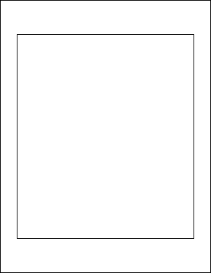

# FrameRect Function

Adds a rectangular frame to the current page.

## Syntax

```csharp
int FrameRect()
int FrameRect(bool inside)
int FrameRect(double radiusX, double radiusY)
int FrameRect(double radiusX, double radiusY, bool inside)
```

## Params

| Name | Description |
| --- | --- |
| radiusX | Horizontal radius for rounded corners. |
| radiusY | Vertical radius for rounded corners. |
| inside | Whether to draw the frame inside the rectangle. |
| return | The Object ID of the newly added Graphic Object. |

## Notes

Draws a frame around the current rectangle, using the current color, width, and options. Corner radii produce rounded corners; using half the rect width/height draws ovals/circles.

By default, frames are drawn outside the rectangle; set `inside` to true to draw within its bounds.

## Example

Inset the rect and add a frame.

```csharp
using var doc = new Doc();
doc.Rect.Inset(50, 100);
doc.FrameRect();
doc.Save(Server.MapPath("docframerect.pdf")); // Windows specific
```

## Results

 — docframerect.pdf
