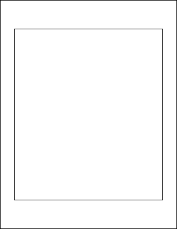

# FrameRect Function

Adds a rectangular frame to the current page.

## Syntax

```csharp
int FrameRect()
int FrameRect(bool inside)
int FrameRect(double radiusX, double radiusY)
int FrameRect(double radiusX, double radiusY, bool inside)
```

## Params

| Name | Description |
| --- | --- |
| radiusX | The horizontal radius to use for rounded corners. |
| radiusY | The vertical radius to use for rounded corners. |
| inside | Whether to draw the frame inside the rectangle. |
| return | The Object ID of the newly added Graphic Object. |

## Notes

Adds a rectangular frame to the current page. The frame location and size is determined by the current rectangle, the line color is determined by the current color, the line width is determined by the current width and any options are determined by the current options.

By specifying values for the horizontal and vertical radius parameters you can draw rectangles with rounded corners. The values refers to the radii of the ellipse used to draw the corners.

By setting the horizontal radius parameter to half the width of the rect and the vertical radius parameter to half the height of the rect you can draw ovals and circles.

By default frames are drawn round the outside of the current rectangle. This allows you to add content and then frame it ensuring that the frame and the content do not overlap. However sometimes you may wish to draw the frame round the inside of the rectangle. You can do this by setting the inside parameter to true.

The FrameRect function returns the Object ID of the newly added Graphic Object.

## Example

The following code adds a black frame to a document. The frame is 
            inset from the edges of the document by 50 points horizontally and 
            100 points vertically.

```csharp
using var doc = new Doc();
doc.Rect.Inset(50, 100);
doc.FrameRect();
doc.Save(Server.MapPath("docframerect.pdf")); // Windows specific);
```

Also see related examples in XHtmlOptions properties such as ForChrome, ForGecko, ForMSHtml, ForWebKit, BrowserWidth, HideBackground, HtmlCallback, HtmlEmbedCallback, ImageQuality, LogonName, RetryCount.

## Results

 — docframerect.pdf
