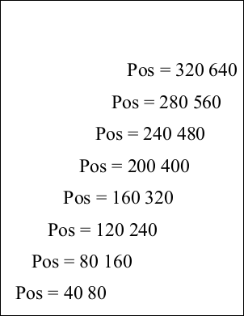

# Pos Property

&nbsp;

## Notes

This property determines the current drawing position.

This is used by the AddText and AddTextStyled methods. Text is placed within the Rect at the starting point specified by the Pos.

When you change the Page or Rect properties the Pos is automatically reset to the top left of the current Rect.

In general use, the  Pos specifies the top left corner of characters and text is positioned in rows  from left to right and   top to bottom. After adding text using the AddText method, the Pos is updated to point to the next text insertion position - at the top of and just after the last drawn character.

However East Asian scripts may also be positioned top to bottom, right to left. For this reason fonts may be specified as vertical - indicated using the FontObject.WritingMode property. In this situation  the value of the Pos is not updated after calling AddText.

This  is the case because ABCpdf applies vertical text flow  via an internal transformation applied to Pos. All horizontal positioning settings are applied to vertical coordinates and vice versa.  The transformation rotates the coordinate system by 90 degrees clock-wise and maps the top-left corner of the Rect to the top-right corner of the Rect. Hence the default initial value of Pos specifies that vertical text should start at the top-right corner of the Rect. This is similar to Windows processing of text using an East Asian font whose name is prefixed with @ and applying the transformation only at the last step.

For this reason note that the effects of XTextStyle.CharSpacing and XTextStyle.WordSpacing depend on the writing mode.

Please note that text in vertical fonts and text in horizontal fonts do not mix well, so stick to one type for each text area you create.

## Example

The following code creates a PDF document with text positioned at 
            a number of different points within it.

```csharp
using var doc = new Doc();
doc.FontSize = 48;
for (int i = 1; i <= 8; i++) {
  doc.Pos.X = i * 40;
  doc.Pos.Y = i * 80;
  doc.AddText($"Pos = {doc.Pos}");
}
doc.Save(Server.MapPath("docpos.pdf")); // Windows specific);
```

Also see related examples in XHtmlOptions properties such as ForChrome, ForGecko, ForMSHtml, ForWebKit, BrowserWidth, HideBackground, HtmlCallback, HtmlEmbedCallback, ImageQuality, LogonName, RetryCount.

## Results

 — docpos.pdf
