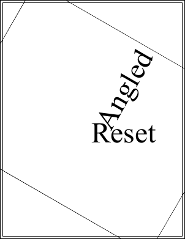

# Reset Function

Reset to the identity.

## Syntax

```csharp
void Reset()
```

## Notes

This method resets the transform to it's original state. This state is known as the identity and indicates that no transformation will be applied.

## Example

Here we add some text rotated at 60 degrees around the middle of 
            the document. We then reset the transform and draw some more text. 
            This text is drawn with no rotation because the transform has been 
            reset.

```csharp
using var doc = new Doc();
doc.Rect.Inset(10, 10);
doc.FontSize = 96;
doc.Transform.Rotate(60, 302, 396);
doc.Pos.String = "302 396";
doc.AddText("Angled");
doc.FrameRect();
doc.Transform.Reset();
doc.Pos.String = "302 396";
doc.AddText("Reset");
doc.FrameRect();
doc.Save(Server.MapPath("transformreset.pdf")); // Windows specific);
```

Also see related examples in XHtmlOptions properties such as ForChrome, ForGecko, ForMSHtml, ForWebKit, BrowserWidth, HideBackground, HtmlCallback, HtmlEmbedCallback, ImageQuality, LogonName, RetryCount.

## Results

 — transformreset.pdf
