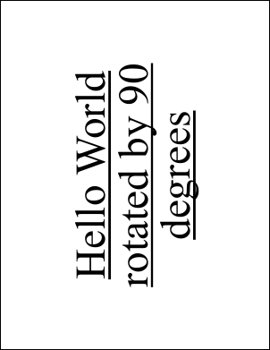
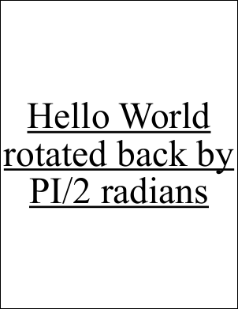

# AngleUnit&nbsp;Property

&nbsp;

## Notes

Specify the angle unit as used by the Rotate method.

The AngleUnitType enumeration may take the following values: DegreesRadians

## Example

```csharp
using var doc = new Doc();
doc.FontSize = 96;
doc.TextStyle.HPos = 0.5;
doc.TextStyle.VPos = 0.5;
doc.Transform.Rotate(90, doc.Rect.Width / 2, doc.Rect.Height / 2);
doc.TextStyle.Underline = true;
doc.AddText("Hello World rotated by 90 degrees");
doc.Page = doc.AddPage();
doc.Transform.AngleUnit = WebSupergoo.ABCpdf13.XTransform.AngleUnitType.Radians;
doc.Transform.Rotate(-1 * Math.PI / 2, doc.Rect.Width / 2, doc.Rect.Height / 2);
doc.AddText("Hello World rotated back by PI/2 radians");
doc.Save(Server.MapPath("transformrotate.pdf")); // Windows specific);
```

## Results

 — transforrotate.pdf, page 1
 — transforrotate.pdf, page 2
